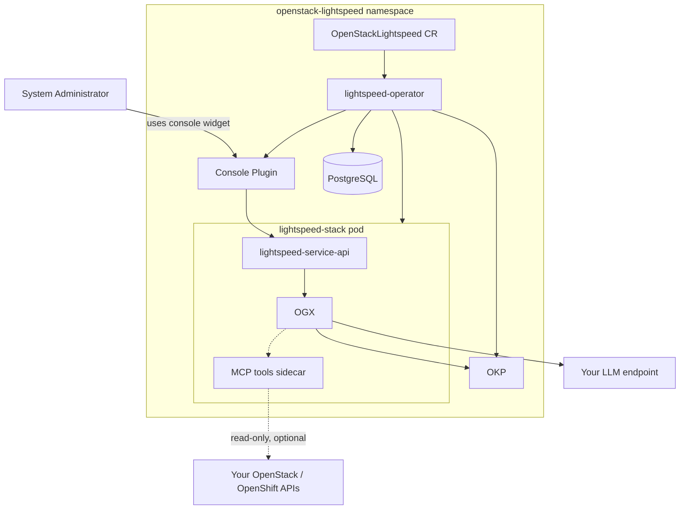

# Development

This page is for contributors and anyone testing changes locally — not
needed if you're just installing and using the operator.

## Local cluster with CRC

For local development/testing only (not for trying the assistant for real
— CRC is resource-constrained). Deploy a CRC cluster before
[installing the operator](install_guide.md#installing-the-operator):

```bash
git clone https://github.com/openstack-k8s-operators/install_yamls.git
cd install_yamls/devsetup
make download_tools

CRC_VERSION=2.51.0 PULL_SECRET=~/work/pull-secret CRC_MONITORING_ENABLED=true CPUS=12 MEMORY=25600 DISK=100 make crc
make crc_attach_default_interface
eval $(crc oc-env)
cd ../..
```

`PULL_SECRET` is the same pull secret described in the
[installation guide](install_guide.md#access-to-registry-images).

CRC's console is always at a fixed address:
[console-openshift-console.apps-crc.testing](https://console-openshift-console.apps-crc.testing) — not something you
look up with `oc whoami --show-console`.

Running CRC remotely? Reach that console with `sshuttle`:

- Add to your local `/etc/hosts` (keep the IP as-is):
  `192.168.130.11 api.crc.testing canary-openshift-ingress-canary.apps-crc.testing console-openshift-console.apps-crc.testing default-route-openshift-image-registry.apps-crc.testing downloads-openshift-console.apps-crc.testing oauth-openshift.apps-crc.testing`
- Run `sshuttle -r $remote_username@$remote_server 192.168.130.0/24`.

## Architecture



**OKP is deployed on every install, not opt-in.** It's the default RAG
source; the bundled community documentation is available too, but only if
you explicitly opt in. See [Configuration](configuration.md) for details.

## Pod security defaults

Operator-managed workloads are hardened by default with explicit
`securityContext` settings:

- `runAsNonRoot: true`
- `allowPrivilegeEscalation: false`
- `capabilities.drop: ["ALL"]`
- Pod-level `seccompProfile.type: RuntimeDefault` where supported

`readOnlyRootFilesystem: true` is enabled for most containers where
validated. Current intentional exceptions are:

- **OKP** container (runtime writes to image-managed paths)
- **MCP** sidecar (optional dev feature; may need mutable runtime paths)

If you change container startup behavior or image layout, re-validate
writable paths before enabling/disabling `readOnlyRootFilesystem`.
