Architecture
============

      lightspeed-operator, which manages the Console Plugin, PostgreSQL,
      OKP, and a lightspeed-stack pod containing lightspeed-service-api,
      llama-stack, and an MCP tools sidecar. The Console Plugin proxies
      user requests into the pod, llama-stack talks to OKP and to your
      configured LLM endpoint, and the optional MCP sidecar makes
      read-only calls to your OpenStack and OpenShift APIs.

Two things worth calling out that aren't obvious from the box-and-arrow view:

* The MCP tools run as a *sidecar container inside the lightspeed-stack
  pod*, not a separate service — introspection stays local to the pod.
* **OKP is deployed on every install, not opt-in.** It's the default RAG
  source; the bundled community documentation is available too, but only if
  you explicitly opt in. See :doc:`configuration` for details.
